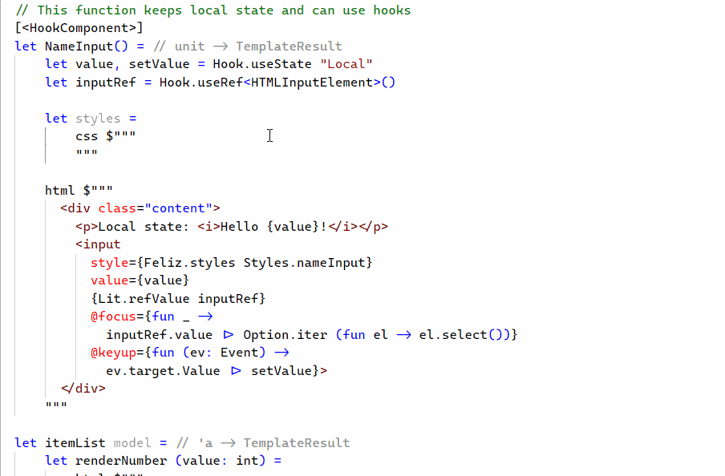

# Syntax highlighting for template strings in F#

VS Code extension that highlights HTML/SVG/CSS/SQL/JS F# triple quoted strings (interpolated or not) preceded by a function named `html/svg/css/sql/js`.

```fsharp
html """<h1>Hello World!</h1>"""
```

You need to declare the functions by yourself. If you need to do some transformation, make the function accept `FormattableString`:

```fsharp
let sql (s: FormattableString) = ...
```

If you just want to trigger highlighting, use an identity function:

```fsharp
let css (s: string) = s
```

> The extension will also accept functions ending with `_html`/`_sql`/etc.

For HTML/CSS/JS templates, the extension will forward completion and hover requests to the built-in language providers in VS Code.

